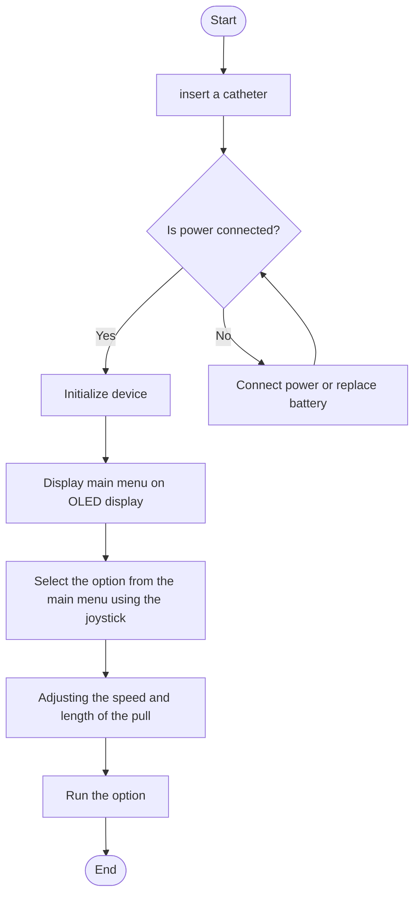

```mermaid
flowchart TD;
 A([Start]) --> B[insert a catheter] --> C{Is power connected?}
 C -- Yes --> D[Initialize device] --> E[Display main menu on OLED display]
 C -- No --> F[Connect power or replace battery] --> C
 E --> G[Select the option from the main menu using the joystick] --> H[Adjusting the speed and length of the pull] --> I[Run the option] --> J([End])
```

